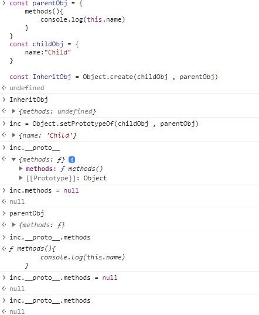
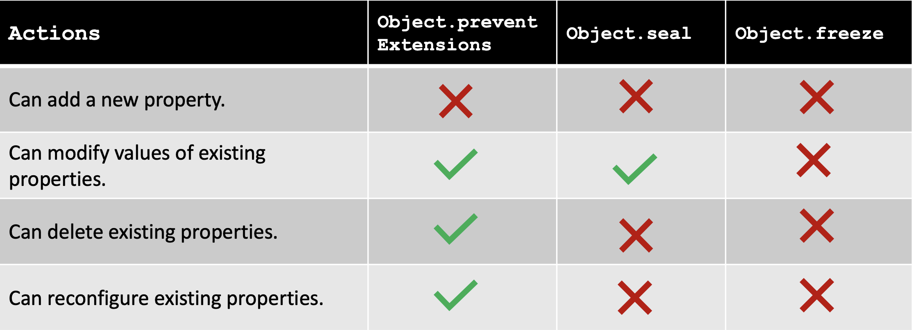
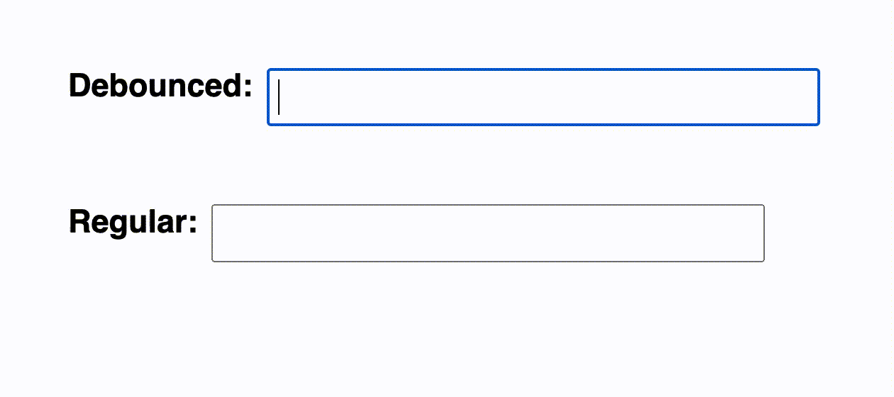

- [Objects](#objects)
  - [structuredClone](#structuredclone)
  - [getters](#getters)
  - [setters](#setters)
  - [(getters and setters ) vs Proxy](#getters-and-setters--vs-proxy)
  - [enumerable](#enumerable)
  - [Protype Changing](#protype-changing)
  - [Shadow properties](#shadow-properties)
  - [The ways tp set Portotype](#the-ways-tp-set-portotype)
    - [Object Create](#object-create)
  - [Important Methods](#important-methods)
    - [hasOwn()](#hasown)
    - [assign](#assign)
    - [getPrototypeOf()](#getprototypeof)
    - [setPrototypeOf()](#setprototypeof)
  - [assign vs Create](#assign-vs-create)
    - [is](#is)
    - [isExtensible](#isextensible)
    - [isFrozen](#isfrozen)
    - [isPrototypeof](#isprototypeof)
    - [isSealed](#issealed)
    - [isSealed vs isFrozen](#issealed-vs-isfrozen)
    - [keys](#keys)
    - [entries](#entries)
    - [value](#value)
    - [keys vs entries](#keys-vs-entries)
    - [preventExtension](#preventextension)
    - [freeze](#freeze)
    - [seal](#seal)
    - [seal vs freeze vs preventExtension](#seal-vs-freeze-vs-preventextension)
    - [defineProperty](#defineproperty)
  - [What are property Descriptors??](#what-are-property-descriptors)
- [JS DS ALGO ISSUES](#js-ds-algo-issues)
- [Function](#function)
  - [Currying](#currying)
  - [Closures](#closures)
- [Aync](#aync)
  - [Promises](#promises)
  - [async/await](#asyncawait)
  - [Promises vs async/await](#promises-vs-asyncawait)
- [Timers](#timers)
- [Advance Topics](#advance-topics)
  - [Memorization](#memorization)
  - [Debouncing and throttling](#debouncing-and-throttling)
    - [Debouncing](#debouncing)
    - [Throttling](#throttling)
- [Script Loading](#script-loading)
  - [Defer](#defer)
  - [Async](#async)
  - [AbortController](#abortcontroller)
    - [Network Call AbortController](#network-call-abortcontroller)
    - [Event Handler Abort Controller](#event-handler-abort-controller)
    - [Custome Use Case](#custome-use-case)
- [It can be use for exiting heavy process](#it-can-be-use-for-exiting-heavy-process)
  - [generator in js](#generator-in-js)
  - [MutationObserver](#mutationobserver)
  - [Service Worker](#service-worker)
  - [IndexDB](#indexdb)
- [EVENTS Concept of JS](#events-concept-of-js)
  - [Bubbling vs Capturing](#bubbling-vs-capturing)
    - [Capturing](#capturing)
    - [Bubbling](#bubbling)
      - [stopPropogation()](#stoppropogation)
  - [Event Delgation](#event-delgation)
    - [currentTarget vs target](#currenttarget-vs-target)
  - [Load vs DOMContentLoaded](#load-vs-domcontentloaded)
  - [Basic OOPS](#basic-oops)
  - [Design Patterns](#design-patterns)
    - [SOLID princple](#solid-princple)
  - [Memorization](#memorization-1)


## Objects

### structuredClone
### getters
Like in vue js we had **computation** property in this we have getters in case while getting avalue or a peroperty of an object we need to computate something we use the **getters** for it ;

```js
    <!-- totalMoney: 10000000, -->
const abhishek = {

    get balance(){
        return  "Mind Your Own Business"
    }
    
}

const rect = {
    length : 100 ,
    breadth : 100 ,
    get area(){
        return this.length * this.breadth 
    } 
}
console.log(rect.area) // 10000 (will run the function but you can use it as a property)
```

### setters
The setters property are **not enumerable** so you wont get the via Objec keys .
**The Getter And Setter can be removed via delete keyword**


```js
const user = {
     firstName: '',
     lastName:'',
     set fullName(name){
         [this.firstName , this.lastName] = name.split(' ')
     }
 } 
 user.fullName = 'Saksham Bakshi';
 //user.firstName = Saksham
 //user.lastName = Bakshi it will be set via that funcation
```

### (getters and setters ) vs Proxy

### enumerable 

The enumerables in js means those properties on js Object that can be viewed and that be looped like via **for of** loop or what you are returned via **Object.keys**

### Protype Changing


### Shadow properties

### The ways tp set Portotype
There are 2 kinds of way to do this: 
- Object.create
- Object.assign

#### Object Create
The Object.create can be used to create a protype propert on an Object
```js
const parentObj = {
    methods(){
        console.log(this.name)
    }
}


const childObj = Object.create(parentObj)
childObj.name = "This Will Console when you invoke methods on ChildObj"
```

```js
function Shape(){
    this.x = 0 
    this.y   = 0 

    function move(x , y ){
        [this.x , this.y]=[x , y]
    }
}
function Rect() {
    Shape.call(this)
}
Rect.prototype = Object.create(Shape.prototype ,{
    contructor:{
        value: Rect,
        writable: true 
    }
})
```

### Important Methods

#### hasOwn()
It returns the **boolean value** whether the given object and **propertyName** string (key) and telling whether its inherited or its own property


#### assign 

-It only works on the enumerable property or those property that can be assigned or Reset. Basically all the property that are not inherited and existed to an object .

#### getPrototypeOf()
The getPrototypeOf is a method in which will the parent or immediate prototype of the given object. You can find all the parent 

```js
obj = Date
do {
    console.log("Start" ,obj)
    obj = Object.getPrototypeOf(obj);
    
    console.log("Finish" ,obj)
}while(obj)

//Object protype is null so it will end
```
#### setPrototypeOf()

The setPrototypeOf takes **childObject** **parentObj** or prototype  take it as parameter and then mutatate the childObj directly by setting up its prototype to a parentObj **and mutatate directly** and the prototype is marked as refrence so if the protype method or property is set the original parent obj also change

```js
const parentObj = {
    methods(){
        console.log(this.name)
    }
}
const childObj = {
    name:"Child"
}

const InheritObj = Object.create(childObj , parentObj)
undefined
InheritObj
{methods: undefined}
inc = Object.setPrototypeOf(childObj , parentObj)
{name: 'Child'}
inc.__proto__
{methods: ƒ}methods: ƒ methods()[[Prototype]]: Object
inc.methods = null
null
parentObj
{methods: ƒ}methods: ƒ methods()length: 0name: "methods"arguments: (...)caller: (...)[[FunctionLocation]]: VM90:2[[Prototype]]: ƒ ()[[Scopes]]: Scopes[2][[Prototype]]: Object
inc.__proto__.methods
ƒ methods(){
        console.log(this.name)
    }
inc.__proto__.methods = null
null
inc.__proto__.methods 
```

### assign vs Create 
The assign is to assign the property to new object and were as in the create a protype on object


#### is
It is used to compare two value wether two value is same mind it cqan help you to detect wether the object is of same refernce not having same value 
 

#### isExtensible


#### isFrozen


#### isPrototypeof 
Its **not a static method but a prototype** it helps us to check the protype of the object like for Example

```js
function Foo(){}
function Boo(){}

Boo.prototype = Object.create(Foo.prototype)

const bar  = new Boo();

console.log(Foo.prototype.isPrototypeOf(bar))
console.log(Boo.prototype.isPrototypeOf(bar))

```

#### isSealed


#### isSealed vs isFrozen


#### keys
The Object.keys() helps us to get array of keys String of an object passed in arguments

#### entries
The entries static method returns the enumerable properties **keys and value subArray**

```js
Object.entries({key:'value'})
[
    [key , value ]
]
```
#### value
The Object.value() returns the values array of the object

#### keys vs entries
The **keys vs entries** method takes same type and value of argument and key return just array of key (string) and in the case of entries you can get sub-array of key and value

#### preventExtension
The preventExtension method takes object as an argument and makes unextensionable i.e you will not be able to add  new property

#### freeze
The freeze niether let you add new property or update , delete protery or change the property descruptor and it works different with strict  mode

```js
Object.freeze(obj)
Object.defineProperty(obj, "ohai", { value: 17 });
Object.defineProperty(obj, "foo", { value: "eit" });

// It's also impossible to change the prototype
// both statements below will throw a TypeError.
Object.setPrototypeOf(obj, { x: 20 });
obj.__proto__ = { x: 20 };

```

#### seal
It just lets you modify existing value 

#### seal vs freeze vs preventExtension



#### defineProperty
Helps to define propert with descriptors
**enumerable; configurable; writable; value**

### What are property Descriptors??
The propert descriptors are the property typeof object like is it a **getter , setter ;  enumerable ; configurable ; writable ; value**


## JS DS ALGO ISSUES

- sliding window
- two pointer technique
- SORTING
- LINCKED list


## Function
### Currying
### Closures
---
## Aync Activities  
### Promises
#### Promise constuctor Methods
##### then
##### catch 
##### finally 

#### Promises Static Methods
##### allSettled
##### any
##### race
##### reject
##### resolve


### async/await
### Promises vs async/await
---
## Timers

### setTimeout
### clearInterval
### setInterval
### clearInterval
---
## Advance Topics
### Memorization

### Debouncing and throttling
For [Overview](https://jools.dev/debounce-and-throttle-functions-in-javascript) read thsi 


#### Debouncing

What debouncing does is that whenver a function is called which is debounced it will run it after given/specified interval of time if during that the wait duration another invoaking is done it will reset the time and start againb the time unless the last even is fired and after that given duration it will execute  
```js
function basicDebounceImplementation(fn , duration){
    let debounceTimer = null ;
    return function (){
        const [context , args] = [this , arguments]
        if(debounceTimer) clearInterval(debounceTimer); // the more you call the  later  the function will be called 
        debounceTimer = setTimeout(() => fn.apply(context ,args) , duration))  
    }
}
 ```
**Rate Limiting**
#### Throttling
What throttle does is that it execute the function and waits for the given  time and even through the same function is being called or same event is running it will pause for a given duration after that if the event continous it will run it and then pause the repeated executrion for that time 
**Rate Limiting**
```js
function basicThrottlingImplementation(fn , duration ){
    const isThrottling = false 
    return function (){
        if(isThrottling) return null
        const [context , args] = [this , arguments];
        isThrottling = true;
        setTimeout(() =>{isThrottling = false} , duration) 
        fn.apply(context ,args )
    }
       
}
```
---
## Script Loading
### Defer
### Async
---
### AbortController
[Docs](https://developer.mozilla.org/en-US/docs/Web/API/AbortController/signal) 

The AbortController is a really helpful if you want to cancel WEB API network call and anything async (like **event handler** and **websocket**) and its really helpful to manage un-nessary calling going out and manage wrong cb running and unnesscary load on the server  .


AbortController Comes it with its event as well 

We can event listen on signal that whether the particaly **Controller** is aborted or not so for example when some contoller is aborted you wnat to some request to a server or log or perform anyother action this is the place and we can also use this to abort anything that does take signal example websocket

---
#### Network Call AbortController
I have used this in reall time sports betting application as user can select any sport page and if the user changes very fast befor previous one is even loaded this can create a  unnessary work to be done both backend and frontend and it will show the previous sport and the next support according how their network are being completed and how ther callbacks are being executed but if user have changed or selected a new sport and aprevious one is not loaded just cancelled it .

Understand this with the **Netflix** example if you select stranger game and you say fuck off lets watch something old school like **friends** and meantime it the stranger game is still being fetched and a spinner on the page and the user clicks on the back button and click your new old school show it will now be loading  both the starger game and friends . But with the help of our hero abortcontroller you can cancel stranger games and only load the friend saving both server resouces and  the client resources.


```js

// a video play example
let controller 

let playbutton = doument.getElementById("play")

let abortButton = document.getElementById("abort")


abortButton.addEventListner('click' , () =>{
    if(controller){

        controller.abort();

    }

})


function fetchVideo(){

    controller = new AbortController();
    const signal = contoller.signal 

    fetch("ENTER_YOUR_URL" , {signal}),then(resp =>{
        controller = null 

    }).catch((err)=> {
        console.error(err);
    })

}

```
---
#### Event Handler Abort Controller
Turns you can use abortcontroller to stop / abort event as well. It can be used to remove events , example you have many hundres all event register and you want to remove it togther you can passing the signal property and cancel/remove all the event handler


```js

const controller = new AbortController();
const signal = controller.signal ;


const button1 = document.getElementById('btn1')
const button2 = document.getElementById('btn2')
const button3 = document.getElementById('btn3')

button1.addEventListner('click' , function (){
    console.log("Just console on click")
} , {signal})
button2.addEventListner('click' , function (){
    console.log("Just console on click")
} , {signal})
button3.addEventListner('click' , function (){
    console.log("Just console on click")
} , {signal})


const removeBtn = document.getElementById('removeBtn')
removeBtn.addEventListner('click' , ()=>{
    controller.abort() // aall event wil be removed
})

```


---
#### Custome Use Case

Lets just consider you want to abort a websocket which doest not take signal as a parameter.


```js  
const controller = new AbortController();
const {signal} = controller 

function initWebSocket(){
    const soket = new Websocket();

    if(signal.aborted){
        socket.close();// incase if controller befir the connection is made
    }

    signal.addEventListner('abort' , () => socket.close( ) , {once: tue } /*once is passed to tell it should only be run one time only*/) // you can use to aort event to make your custom abort for async process like file action , stream , etc 
}


```
It can be use for exiting heavy process 
---
### generator in js

- The yield is used to pause the function and is used to give out the value
- the yield also take the value and start it again from where it had left (We can pass in the value to another yield expression .)
- *yield its used to pause and delegate it to anyother gernator function outside its generator function .


After the invocation of that function you get the **iterable object** with a **done** property and a **value** . 
The value will be false and to resume **next method** we can continue to this until **done** is **false**

### MutationObserver


### Service Worker
[Resources](https://www.youtube.com/@SteveGriffith-Prof3ssorSt3v3)


### IndexDB

## EVENTS Concept of JS

### Bubbling vs Capturing
#### Capturing
Its by default false
#### Bubbling
##### stopPropogation()
### Event Delgation
Use in the case of the bubbling as image you ve the hundred of li or lots of sibling element instead puting evengt on each one of them you can add and  ommponent parent and listen the event over there via the property of the Bubbling
#### currentTarget vs target 
- The currentTarget provided you with the element on which the event listner is added but  in the case of the target it tells you where the event is triggered or actaul event happends. 

### Load vs DOMContentLoaded
DOMContentLoaded is loaded when the dom is parsed and load when all the script , styles are loaded

---


### Basic OOPS 

CLASS VS INTERFRENCE

### Design Patterns

#### SOLID princple

### Memorization 


[
    "Debouncing & Throttling | Interview Prep | Browser Module | Web Dev In Hindi",
    "DOMContentLoaded Vs Load Events | Interview Prep | Browser Module | Web Dev In Hindi",
    "Defer Vs Async Vs Normal Scripts | Interview Prep | Browser Module | Web Dev In Hindi",
    "CSS Background Properties | Interview Prep | Browser Module | Web Dev In Hindi",
    "Cookies and CSRF Attack!! | Interview Prep | Browser Module | Web Dev In Hindi",
    "CORS Error!! (Cross Origin Resource Sharing) | Interview Prep | Browser Module | Web Dev",
    "CSS Selectors Specifity | Interview Prep | Browser Module | Web Dev In Hindi",
    "HTTP Verbs (Methods, Status codes, Status type) | Interview Prep | Browser Module | Web Dev",
    "CSS Pseudo Classes | Interview Prep | Browser Module | Web Dev In Hindi",
    "CSS z-index Property | Interview Prep | Browser Module | Web Dev In Hindi",
    "XMLHttpRequest Vs Fetch Vs Axios [Network Requests] | Interview Prep | Browser Module | Web Dev",
    "IndexedDB Storage | Web Storage API | Interview Prep | Browser Module | Web Dev In Hindi",
    "Local Storage Vs Session Storage | Web Storage API | Interview Prep | Browser Module | Web Dev",
    "Browser Events [In-depth] | Bubbling, Capturing, Target, Current Target | Interview Prep | Web Dev"
]